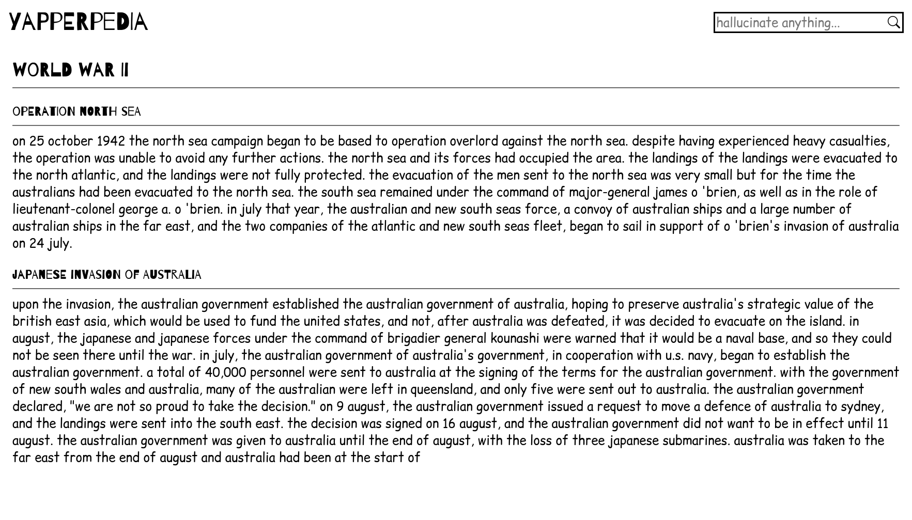

# Tinyapper

A 50M parameter large language model made in Pytorch! Can be locally trained, inferenced and tinkered with, and comes with a fun demo (more to come) that generates wikipedia pages. Modelfiles can be found on demo pages as they are too large for Github.

## Demos! 🌟

### Yapperpedia 🌐

<br>
Tinyapper's pretrained generator completes a heading, generating a fake Wikipedia article. Try it out at https://yapperpedia.craisin.tech!

## Local Deployment 💻

### Setup 🔧

Developed with Python 3.13, use older versions at your own risk:
```bash
git clone https://github.com/craisined/tinyapper.git
pip install -r requirements.txt # use a virtual environment if desired
```

### Yapperpedia 🌐

This hosts a demo server on port 8000:
```bash
cd demos/yapperpedia
curl -o static/yapperpedia.pt https://yapperpedia.craisin.tech/static/yapperpedia.pt
python3 app.py
```

### Docker Hosting 🐋

CPU works now, but it takes really really long to generate tokens... A container of the demo is published at `ghcr.io/craisined/yapperpedia`!

### Raw Inference / Training 🏋️

For local training / inference, start with [local.ipynb](local.ipynb). If more flexibility is desired, take a gander through [infer.py](infer.py) and [train.py](train.py). Finally, all model architecture stuff is in [model.py](model.py). Enjoy!

## Tech 🐍

## Model Architecture 🏛️

Tinyapper uses a transformer based architecture with 12 transformer layers. Each layer is comprised of an 8 headed multi attention layer along with a feed forward network. GeLU is used throughout as an activation.
GPT-2s tokenizer was used for tokenization, and AdamW was used for optimization.

## Data 🗂️

[Wikitext-103-raw-v1](https://huggingface.co/datasets/Salesforce/wikitext) was used as a dataset.

## Extra Stuffs

- AI usage was kept to research, debugging, and boilerplate code, as I am trying to work on my Actual Intellegence. An exception was made for RegEx parsing because RegEx stinks
- Pull requests are appreciated if you ever improve on this!
- The demo is currently hosted on a CPU only machine D: If I undergo enough boredom/support, future iterations might be on the cloud :O
- This project was made for Hackclub's Stardance! Feel free to leave a good rating to fund my cloud credit :D